# Stress Prediction Pipeline: Real-Time Kafka

A containerized Kafka streaming pipeline for processing worker stress data in real-time. Integrates with Java-based Flink for ML inference.

## Architecture

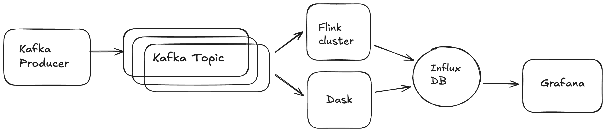

## Flink Workflow
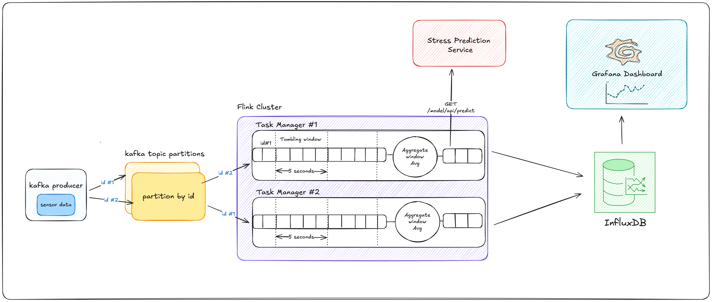

## Prerequisites

- **Docker Desktop** (with Docker Compose v2)
- **Git**
- **Java 17**
- **Python 3.8+** (for local development, optional)
- **2 GB+ available disk space**


## Quick Start For Primary Flink Workflow (5 minutes)

### 1. Clone the Repository

```bash
git clone https://github.com/peppermintflowers/nurse_stress_prediction.git
cd nurse_stress_prediction
```

### 2. Verify Docker is Running

```bash
docker --version
docker compose version
```

Both should output version info. If not, install Docker Desktop.

### 3. Start All Services

From the project root (`nurse_stress_prediction`), run:

```bash
docker compose up --build -d
```

This will:
- Pull/build all images 
- Start containers in detached mode
- CSV producer will immediately begin streaming data from csv files in `data/workers.csv.zip` to Kafka

### 4. Verify Services are Running

```bash
docker compose ps
```

### 5. Monitor the Pipeline

**Kafka UI Dashboard** (view topics & messages):
- Open http://localhost:8080 in your browser
- Navigate to **Topics** → **stress-topic** to see messages flowing
  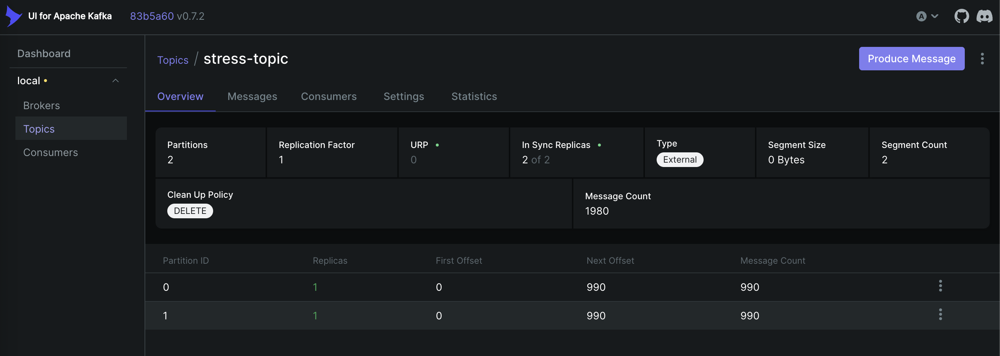
- Open http://localhost:8081 in your browser
- Check that flink is up and two task slots are available
  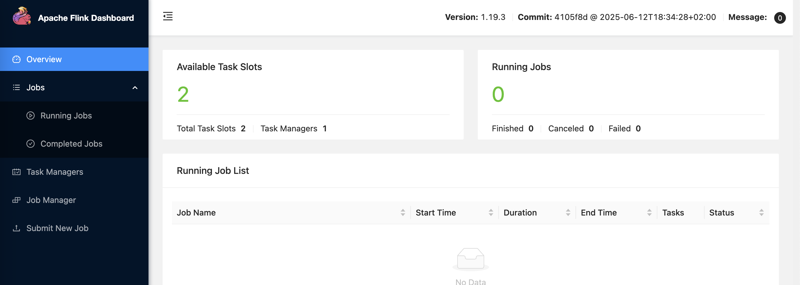

**Producer Logs** (see data being sent):
```bash
docker compose logs csv-producer --tail 50 -f
```
**View Logs for other services**
```bash
# All services
docker compose logs -f

# Specific service
docker compose logs kafka -f
docker compose logs csv-producer -f
docker compose logs flink-jobmanager -f

# Last N lines
docker compose logs --tail 100
```

### 6. Build Flink Job Jar
- Run from project directory
```bash
cd flink-stress-data-processor
mvn clean package
```
- After executing the above commands the flink-stress-data-processor-1.0-SNAPSHOT.jar should get generated in the target folder of flink-stress-data-processor directory

### 7. Submit Flink Job Jar 
- Open http://localhost:8081 in your browser
- Navigate to
- Upload the jar file "flink-stress-data-processor-1.0-SNAPSHOT.jar" generated in previous step and submit the job
  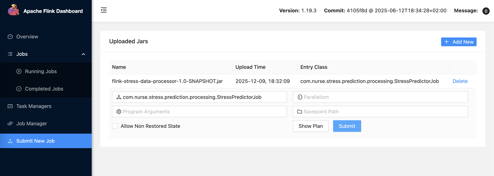
- Verify that the job is running and that real-time watermarks are generated
  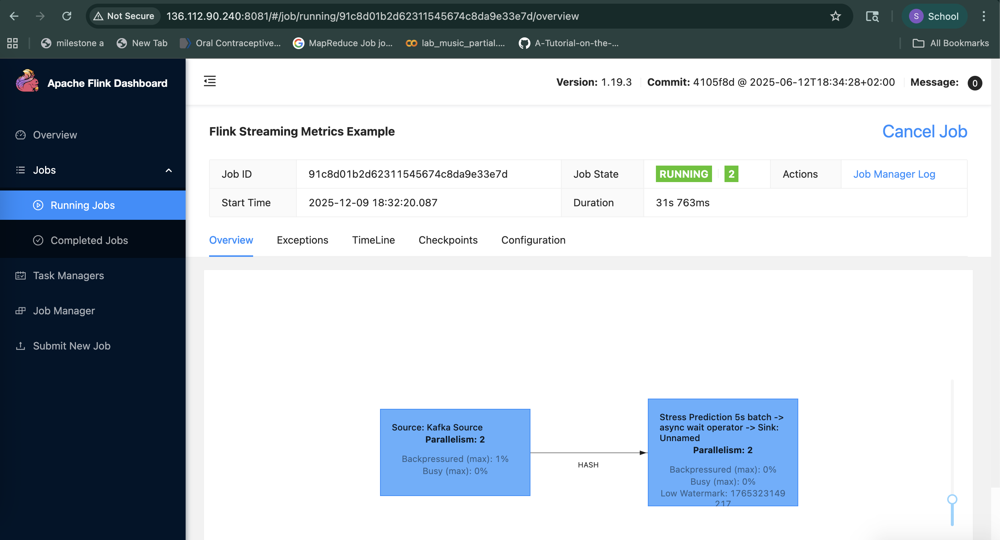
  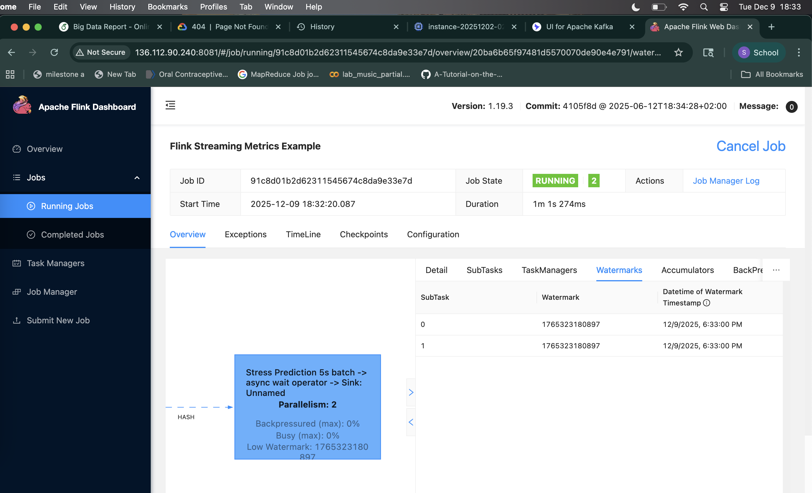

### 8. Create dashboard in Grafana and visualise results
- Open http://localhost:3000 in your browser
- Use admin/admin as credentials
- Connect to InfluxDB 
- Use UI to build queries and create dashboards to visualise the real-time processed data
  


  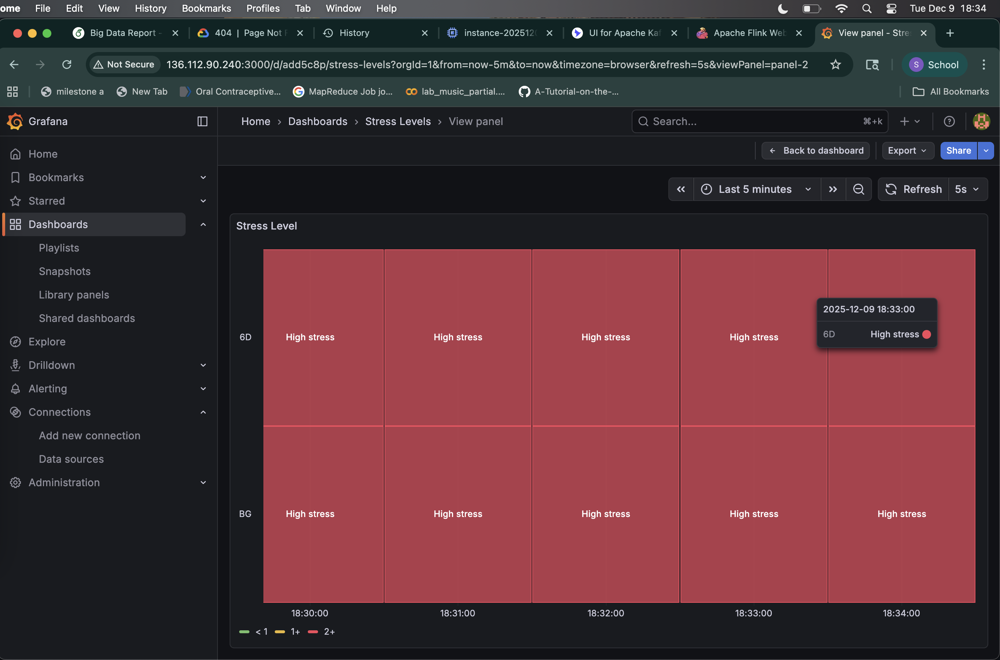


  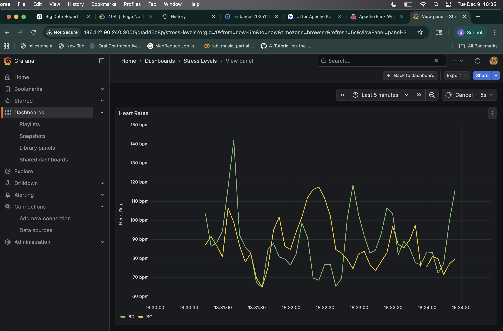


  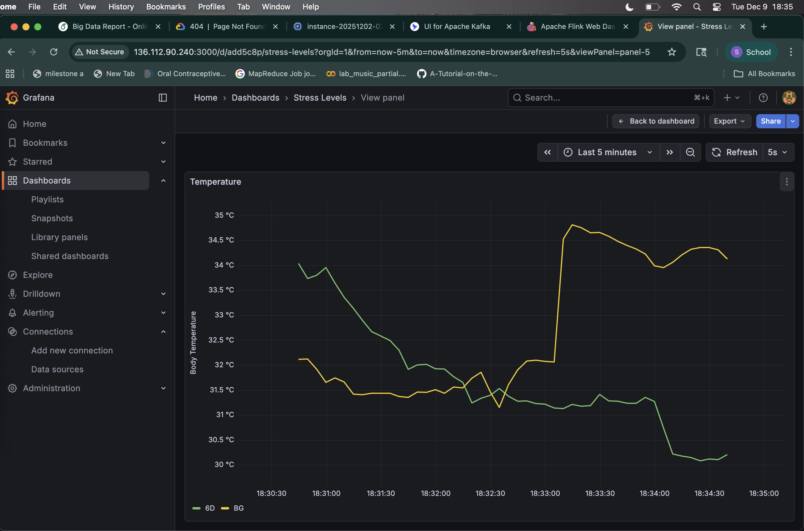


  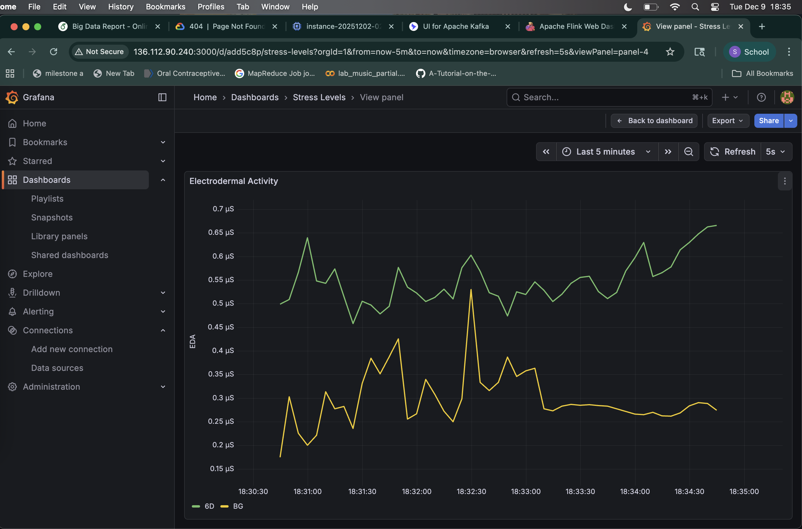


### Dask Fallback System

This project includes an **automatic fallback system** using Dask ML that activates when the primary Flink pipeline experiences resource constraints. The fallback ensures continuous stress monitoring without data loss.

**Key Features:**
- 🔄 Automatic switching based on processing latency
- 📊 Processes larger batches (1000 messages) at lower frequency
- ✅ Zero data loss via Kafka checkpoints
- 🔧 Fully configurable thresholds and batch sizes
- 📈 Writes to same InfluxDB with `source=dask-fallback` tag

**Quick Start:**
```bash
# System monitors automatically - no action needed
docker compose up -d

# View fallback status
docker compose logs dask-fallback -f

# Test the fallback
cd dask-fallback && ./test_fallback.sh
```

**Documentation:**
- 📖 [Integration Guide](DASK_FALLBACK_INTEGRATION.md) - How it works with existing system
- 📚 [Full Documentation](dask-fallback/README.md) - Detailed technical docs
- 🚀 [Quick Start](dask-fallback/QUICK_START.md) - Commands and tips

## Project Structure

```
.
├── assets
│   ├── architecture_diagram.png
│   └── flink_workflow.png
├── DASK_FALLBACK_INTEGRATION.md
├── dask-fallback
│   ├── ARCHITECTURE.md
│   ├── config.yaml
│   ├── dask_processor.py
│   ├── Dockerfile
│   ├── monitor.py
│   ├── orchestrator.py
│   ├── QUICK_START.md
│   ├── README.md
│   ├── requirements.txt
│   └── test_fallback.sh
├── data
│   ├── create_topic.sh
│   ├── data_processing_for_demo.ipynb
│   ├── Dockerfile.producer
│   ├── nurse_sensor_event.avsc
│   ├── producer.py
│   ├── requirements.txt
│   └── workers.csv.zip
├── DEPLOYMENT_GUIDE.md
├── docker-compose.yml
├── flask-predictor
│   ├── app.py
│   ├── Dockerfile
│   ├── model
│   │   └── stress_prediction_model_lgbm.joblib
│   └── requirements.txt
├── flink-stress-data-processor
│   ├── dependency-reduced-pom.xml
│   ├── Dockerfile
│   ├── pom.xml
│   ├── src
│   │   └── main
│   │       ├── avro
│   │       │   └── SensorRecord.avsc
│   │       └── java
│   │           └── com
│   │               └── nurse
│   │                   └── stress
│   │                       └── prediction
│   │                           ├── model
│   │                           │   ├── IOTPing.java
│   │                           │   └── NurseMetrics.java
│   │                           ├── processing
│   │                           │   ├── AverageAggregator.java
│   │                           │   ├── Constants.java
│   │                           │   ├── StressPredictionAsyncFunction.java
│   │                           │   ├── StressPredictorJob.java
│   │                           │   ├── WatermarkStrategyFactory.java
│   │                           │   └── WindowResultFunction.java
│   │                           ├── sink
│   │                           │   └── InfluxSinkPing.java
│   │                           └── source
│   │                               └── KafkaSourceFactory.java
│   ├── submit-job.sh
│   └── target
│       ├── classes
│       │   └── com
│       │       └── nurse
│       │           └── stress
│       │               └── prediction
│       │                   ├── model
│       │                   │   ├── IOTPing.class
│       │                   │   └── NurseMetrics.class
│       │                   ├── processing
│       │                   │   ├── AverageAggregator.class
│       │                   │   ├── Constants.class
│       │                   │   ├── StressPredictionAsyncFunction.class
│       │                   │   ├── StressPredictorJob.class
│       │                   │   ├── WatermarkStrategyFactory.class
│       │                   │   ├── WatermarkStrategyFactory$1.class
│       │                   │   └── WindowResultFunction.class
│       │                   ├── SensorRecord.class
│       │                   ├── SensorRecord$1.class
│       │                   ├── SensorRecord$Builder.class
│       │                   ├── sink
│       │                   │   └── InfluxSinkPing.class
│       │                   └── source
│       │                       └── KafkaSourceFactory.class
│       ├── flink-stress-data-processor-1.0-SNAPSHOT.jar
│       ├── generated-sources
│       │   ├── annotations
│       │   └── avro
│       │       └── com
│       │           └── nurse
│       │               └── stress
│       │                   └── prediction
│       │                       └── SensorRecord.java
│       ├── maven-archiver
│       │   └── pom.properties
│       ├── maven-status
│       │   └── maven-compiler-plugin
│       │       └── compile
│       │           └── default-compile
│       │               ├── createdFiles.lst
│       │               └── inputFiles.lst
│       ├── original-flink-stress-data-processor-1.0-SNAPSHOT.jar
│       └── project-local-repo
│           └── org.example
│               └── flink-stress-data-processor
│                   └── 1.0-SNAPSHOT
│                       ├── flink-stress-data-processor-1.0-SNAPSHOT-consumer.pom
│                       ├── flink-stress-data-processor-1.0-SNAPSHOT.jar
│                       └── flink-stress-data-processor-1.0-SNAPSHOT.pom
├── grafana_dashboard_dual_source.json
├── HOW_TO_USE_DASK_FALLBACK.md
├── IMPLEMENTATION_SUMMARY.md
├── ml_model
│   ├── stress_model_training.py
│   ├── stress_prediction_model_lgbm.joblib
│   └── stress_prediction_model.joblib
├── README.md
├── verify_both_sources.sh
└── VERIFYING_DATA_FROM_BOTH_SOURCES.md

```

**Branch:** `main`  
**Created:** November 2025
